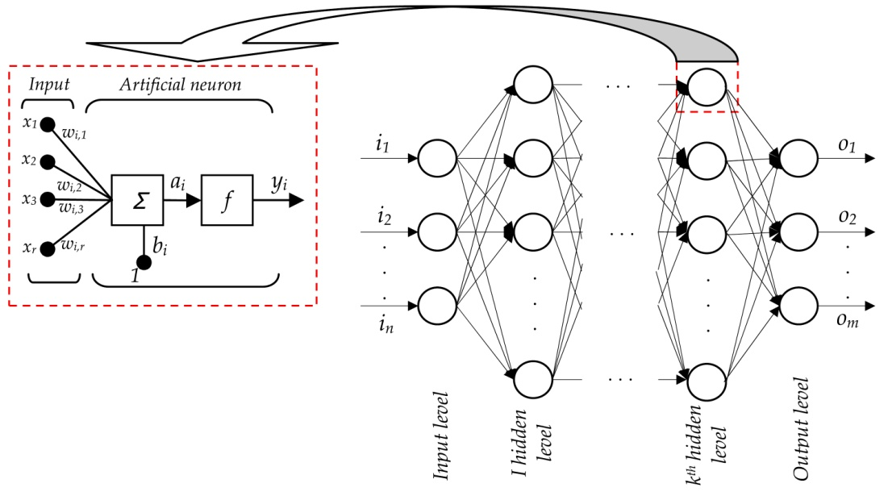
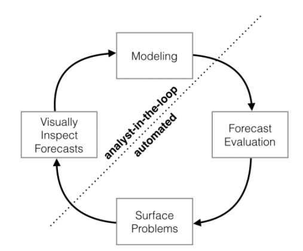
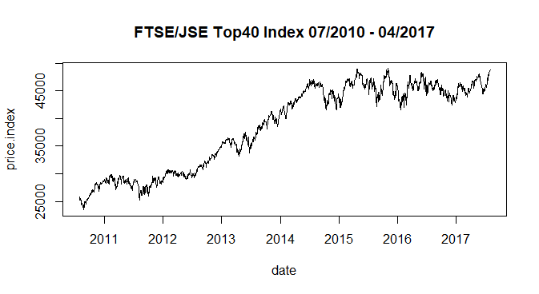
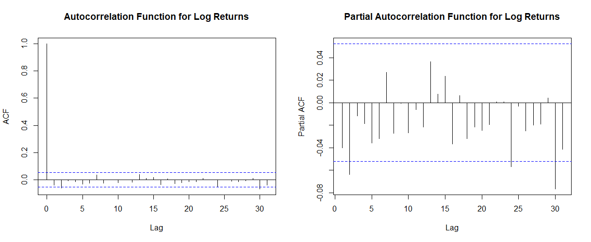
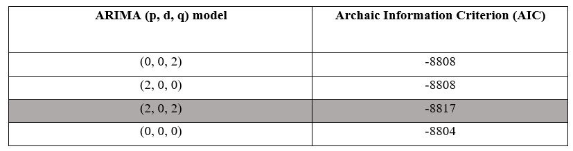
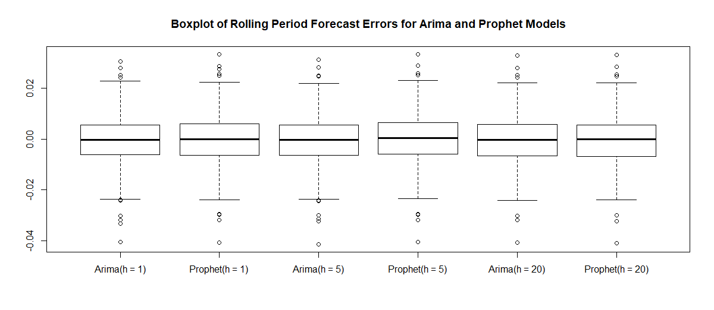
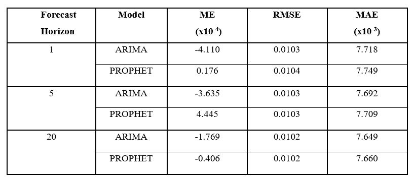
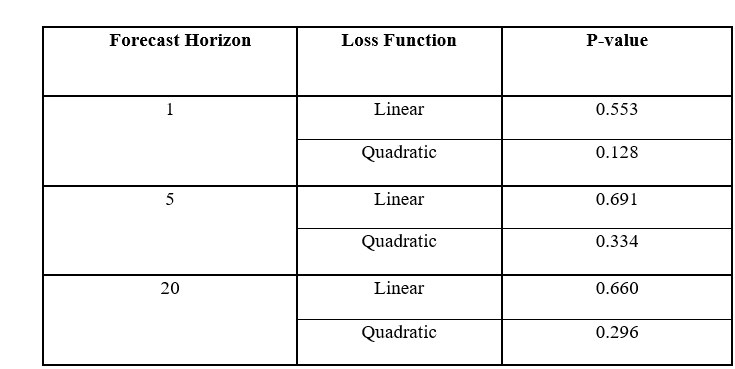

<!-- First: Set your default preferences for chunk options: -->

<!-- If you want a chunk's code to be printed, set echo = TRUE. message = FALSE stops R printing ugly package loading details in your final paper too. I also suggest setting warning = FALSE and checking for warnings in R, else you might find ugly warnings in your paper. -->

```{r setup, include=FALSE}
knitr::opts_chunk$set(echo = FALSE, message = FALSE, warning = FALSE, fig.width = 6, fig.height = 5, fig.pos="H", fig.pos = 'H')
# Note: Include = FALSE implies the code is executed, but not printed in your pdf.
# warning and message = FALSE implies ugly messages and warnings are removed from your pdf. These should be picked up when you execute the command chunks (code sections below) in your rmd, not printed in your paper!

```


<!-- ############################## -->
<!-- # Start Writing here: -->
<!-- ############################## -->

# Introduction\label{Introduction}

In business, including that involving the stock market, analysts require a large number of time series forecasts to inform decision making. The challenge with existing reliable approaches to forecasting time series data are that the models require a considerable background in statistics to build and adapt to prevailing market conditions when needed. Several authors have recommended automatic forecasting, which refers to algorithms that can automatically forecast a large number of univariate time series. However, the forecasts generated by these methods have been found to be brittle as well as inflexible in allowing for prior information to be incorporated into the forecasting model [@taylor2017forecasting]. In February of 2017, Facebook's Core Datascience team open sourced ,Prophet, their time series forecasting tool whose main selling point is that it enables "forecasting-at-scale". A term coined by the data science team which is defined as, "an approach that allows a large number of analysts to forecast a large number and variety of business time series" [@taylor2017forecasting]. It has the added advantage of being less 'expensive'
than other alternatives. In addition, it is specifically prefarable over ARIMA models because of its non-linearity, flexibility and ability to accomodate varying time intervals [@taylor2017forecasting].

The objective of this paper is to compare the rolling period forecasts generated by Prophet (which uses automated, intensive Bayesian Modelling to 'forecast-at-scale'), to those obtained by an ARIMA model (constructed through the Box-Jenkins methodology),
through a Diebold-Mariano evaluation of the JSE Top40 Index. The study is particularly useful because analysts from a wide background can automatically forecast stock price returns, and incorporate their prior knowledge in the model , without a wholesome understanding of the statistical intricacies involved.

The paper is organized as follows. A review of literature relating to stock price forecasting with ARIMA models and other alternative approaches is introduced to give the reader background information on research relating to the subject matter. Thereafter, theory relating to the mathematical formulation and estimation of both the ARIMA and Prophet models is included in sections 2.2 and 2.3 respectively, to build the readers understanding of what the models look like and how they operate. Information relating to the data that was used in this study is contained in section 3, after which, the methodology used to answer the research question is described in section 4. Section 5, contains the results obtained when the methodology was executed, whilst section 6 includes a discussion of the results and how they can be interpreted to answer the research question. Lastly, the conclusion in section 7 highlights the main findings of the study and recommends further areas of research.   

# Background 
In this section we will briefly review literature that relates to the comparison of different approaches to forecasting stock returns. This will include both traditional approaches as well new methods such as automatic forecasting, machine learning techniques and quasi-Bayesian forms which incorporate analysts' prior information. The review of literature is concluded a brief introduction to the Diebold-Mariano evaluation and an outline of its suitability for the purpose of this study. The theoretical and mathematical formulation of an ARIMA forecasting model is  then briefly introduced. Thereafter, the theoretical framework and mathematical formulation of Facebooks' Prophet forecasting tool is discussed. Specific attention is drawn to Prophets distinguising features to give the reader an understanding of the value that this forecasting technique can potentially add to stock price prediction. Lastly, the Diebold-Mariano Evaluation technique is introduced as a method of formally testing superior predictive accuracy between two forecasting models.

##Literature 
###Forecasting stock prices using the ARIMA model

ARIMA models have been widely used as a standard model to forecast financial data and have been shown to yield acceptable forecasting errors [@adebiyi2014comparison]. @adebiyi2014comparison used the Box-Jenkins methodology to build short-term stock price prediction models for stocks on the New York Stock Exchange(NYSE) and the Nigerian Stock Exchange(NSE). Their results showed that the prediction errors of the model were within acceptable bounds.

ARIMA models rely on the assumption that residuals are heteroskedastic(they have a constant variance) and normally distributed, however, some financial data displays heteroskedasticity making GARCH models more applicable. This theory is backed by a study conducted by @Muten2014 who compared the ability of ARIMA and GARCH models to forecast stock prices on the Zimbabwean Stock Exchange (ZSE). They found that the GARCH model outperforms the ARIMA model which suggests that the residuals are heteroskedastic. This is a case in point for emerging market stocks. The researchers noted that poor liquidity in the market could be a cause of the results they observed [@Muten2014].

###Forecasting stock prices using alternative methods: The case of Artificial Neural Networks and Hybrid Models

Though the ARIMA model is tractable given that it is simple, interpretable and yields forecasts that are significantly accurate when compared to other methods, it has its limitations. The most popular being its inability to capture non-linear patterns in data, even after its evolution from the standard form to more adaptable formulations [@moreno2011artificial]. Over the past two to three decades with the evolution of computational power and statistical advancement, other stock price prediction methods have been proposed, the most prominent being a machine learning approach called Artificial Neural Networks(ANNs)[@lin2009short]. Also popular amongst the new stock price forecasting approaches are hybrids of existing methods that incorporate the benefits of different approaches.  

Artificial Neural Networks (ANNs) are a multi-layered perceptron as illustrated in  figure 1.  
  
*Figure 1 : Illustration of an Artificial neural network* [@tanikic2012artificial]  
An ANN consists of a sorted triple $(K, A, \omega)$. $K$ is a set representing the multiple layers/levels of the network i.e. input, hidden and output levels. A is a set of pairs that represents the value of the index of the estimate in the $i^{th}$ node of the $k^{th}$ layer of the network. In the enlarged section of Figure 1, $a_{i,k} \in A$. Lastly, $\omega$ represents a function that defines the weights ($\omega_{i,r}$) of connections between neurons [@kriesel2007brief]. Artificial Neural networks apply iterated optimization of model parameters across the network in the form of weights conditional on observed values to learn [@segaran2007programming]. Several studies have compared ARIMA model forecasts to ANN and their conclusions are contradictory.  

Researchers have found that the performance of either method depends on the nature of the data and forecasting problem [@kihoro2004seasonal]. Stock price data is proposed to be nonlinear which suggests that nonlinear approaches have the potential to produce better forecasts than linear models. Furthermore, ANNs make no assumptions about the distribution of the errors as compared to the linear ARIMA model [@adebiyi2014comparison]. @adebiyi2014comparison compared NYSE stock index forecasts of an ARIMA model to those of an ANN and found that the forecasting accuracy of the ANN model was superior to that of the ARIMA model. It is evident that ANN are preferred to ARIMA models as a model free, nonlinear alternative. However, the model construction of an ANN requires trial and error to initialize parameter estimates and these parameters are not easily interpretable by analysts [@moreno2011artificial]. Researchers have found different ways to guide analysts in this respect. In 1996, @wang1996stock proposed an ARIMA-based ANN to forecast the medium-term price of the Taiwan Stock Exchange Weighted Stock Index (TSEWSI). They used the Box-Jenkins methodology to difference the series and then trained the data on a neural network with initialisations that were guided by their observations of the ARIMA model. This approach yielded forecasts with an acceptable prediction accuracy based on residual analysis of the out-of-sample data. Wang and Leu therefore concluded that the ARIMA-based Neural Network outperformed a Neural Network trained using raw stock price data [@wang1996stock]. @zhang2009stock used a combination of the backpropagation algorithm from Neural Networks with Improved Bacterial Chemotaxis Optimization (IBCO) to build a model that forecasts the S&P 500 stock index by minimizing the mean square error. Model forecasts were evaluated through simulation experiments and the results led to the conclusion that the hybrid model produced superior forecasts [@zhang2009stock]. This study further highlighted the potential that nonlinear approaches have in forecasting stock prices. An issue that arises with such methods is the complexity of the proposed models which limits the flexibility of unseasoned analysts to adjust model parameters as a way of improving forecasting accuracy. As we will see, Prophet forecasting elegantly deals with this issue in the form of a nonlinear, Generalized Additive Model (GAM).

###Quasi-Bayesian methodss incorporating Analysts' knowlegde 

The stock price forecasting approaches considered so far are purely apply technical data analysis methods to generate stock price forecasting models. However, studies that have compared pure technical approaches to those that incorporate the analysts knowledge in a quasi-Bayesian form have been shown to be superior at predicting market prices [@givoly1984quality \& @guerard1989combining]. The first instance of combining time-series model forecasts and an analysts forecasts to obtain superior forecasts of a stocks annual earnings can be dated to 1989. @guerard1989combining used an additive model to combine consensus security analyst forecasts from the S&P Annual Earnings forecaster and annual earnings forecasts generated by an ARIMA model with a constant. The combined model that was estimated using ordinary least squares reduced the mean square error of the time series and analysts forecasts from 1.28 and 1.27, respectively to 1.04. These results suggest that analysts can substantially reduce forecasting errors by combining both approaches [@guerard1989combining]. @zahedi2015application applied the same overarching principle when they used principle component analysis to determine an appropriate input variable, which they then used to train an ANN in an attempt to predict stock prices on the Tehran Stock Exchange. Their model yielded acceptable forecasting errors and performed better than the pure ANN which further reiterates the potential of incorporating an analysts knowledge to improve stock price forecasts, in both linear and nonlinear models.   

###Diebold-Mariano Evaluation
As is evident from the previous sections, the modelling approach and assumptions of Prophet forecasting-at-scale differ to those of an ARIMA model. Since the two methods differ, the Diebold-Mariano evaluation (DM Test) is preferred as a means of testing forecasting accuracy. This is because the DM Test is a model free test of forecasting accuracy. It is applicable to a wide range of situations from multi-period forecasts, non-Gaussian forecast residuals, non-quadratic loss functions and even serially correlated data[@Mariano2000].

## ARIMA Model Formulation

The ARIMA model is a generalisation of Autoregressive Moving Average (ARMA) models which combine autoregression and moving average features [@box1970time]. In the context of returns, the ARIMA formulation for the return at time index $t$, $r_t$, is given by,
$$  r_t = \phi_1 r_{t-1} + \phi_2 r_{t-2} + ...+ \phi_p r_{t-p} + \epsilon_t +
        \psi_1 \epsilon_{t-1} + \psi_2 \epsilon_{t-2} + ... +\psi_q \epsilon_{t-q} $$  
where:  
$\bullet \phi_i$ and $\phi_j$ are the parameters to be estimated;  
$\bullet r_{t-k}$ is the $k^{th}$ lagged return;   
$\bullet \epsilon_t$ is the error term at time $t$ which is assumed to be white noise and  
$\bullet\epsilon_{t-k}$ is the $k^{th}$ lagged error.   
$\bullet$p is the order of the autoregressive component (dependenceon history of $r_t$)
$\bullet$q is the order of the moving average component (dependenceon history of $\epsilon_t$)  

The ARIMA model will be used as a standard forecasting method which Prophet will be compared against. Model building and parameter estimation will follow the approach outlined by @box1970time and is further discussed in the methodology


## Prophet Model Formulation and Estimation

The challenge with many forecasting methods such as the Box-Jenkins methodology and machine-learning approaches are that they usually require a sufficient statistical background. Furthermore, these approaches tend to be inflexible with respect to incorporating prior information. Though this can be partially acheived by initializing parameter estimates for methods such as Artificial Neural Networks ,an analyst with no statistical training can have difficulty interpreting and thus modifying parameter estimates[@taylor2017forecasting].  
Prophet is an **automatic forecasting** tool that uses a Bayesian Generalized Additive model to generate time series forecasts. This is in comparison to conventional methods such as the linear stochastic dependence that exists in ARIMA models. Prophet combines a configurable model that includes performance analysis evaluation with the interaction of an analyst in the loop [@taylor2017forecasting]. The model is configurable which allows an analyst to incorporate their knowledge of the behaviour of the series into the model building process through easily interpretable initial parameters that can be modified and interactive feedback when forecasts under-perform [@taylor2017forecasting]. 

Through this mechanism, a large numer of forecasts can be reliably generated **automatically** with the flexibility of enabling an analyst to modify the model in-the-loop during model specification. The automated forecasting procedure with an analyst-in-the-loop is illustrated in Figure 2.  
  
  The first step of the forecasting procedure begins with the analyst simply specifying a general model. Prophet then goes into the automated process of estimating model parameters and doing forecast evaluation. If forecasts are considered problematic based on evaluations of the Simulated Historical Forecast (SHF) errors, then the package will surface these problems. The process then transitions to the top left of the cycle in Figure 2 labelled analyst-in-the-loop. Here, the analyst can then use visually presented aspects of the results that raised the issues to modify model parameters before a better model is then estimated. The loop is repeated until forecast evaluation surfaces no problems.

{ width=100% }  
*Figure 2: Illustration of Prophets' automated forecasting procedure with an analyst in the loop* [@taylor2017forecasting]  

The interpretability of Prophets' model parameters stems from the mathematical formulation of the forecasting model. The formulation posits that the series is generated by an additive, parametric function of time $r(t)$, defined by,
$$ r(t) = g(t) + s(t) +  h(t) + \epsilon_t.$$ The additive components include growth, seasonality and a component that adjusts for holidays as well as once-off events e.g. anticipated market shocks in the instance of financial time series.


The growth component, $g(t)$, is modelled using a generalized form of the logistic population growth model and is of the form;  
$$g(t) = \frac{C(t)}{1+exp(-(k+\boldsymbol{a}(t)^T \delta(t-(b+\boldsymbol{a}(t)^T \gamma)))}$$  
Where:  
$\bullet C(t)$ represents the carrying capacity of the growth component and can be modelled using a polynomial function of time, the simplest being a constant or linear model.  
$\bullet (k+\boldsymbol{a}(t)^T\delta)$ is the growth rate factor with the $\boldsymbol{a}(t)^T\delta$ term enabling the forecaster to choose where the growth rate changes( i.e change points) and   
$\bullet (b+\boldsymbol{a}(t)^T \gamma)$ is the adjusted offset parameter.  
  
The growth component of the model is generalized with two useful features that allow the carrying capacity and growth rate of the model to vary with time. The model enables an analyst to manually define when and how the growth rate changes at different change points [@taylor2017forecasting]. This feature is particularly useful for forecasting stock price data since analysts are able to incorporate market movements that lead to the growth rate either decreasing, increasing or remaining constant.  
The seasonality component, $s(t)$ with periodicity $P$ and is given by,
$$s(t) = \sum_{n = -N}^{N}c_n \exp(j\frac{2\pi nt}{P})$$

Yearly and weekly seasonality is modelled using the standard Fourier series. Analysts can thus use prior knowledge to account for the effects of periodicities they have observed seasonally which is similar to the periodicity of Seasonal ARIMA models.  
  
  
Lastly, $h(t)$ is the holiday and events component, a feature that ARIMA models are not adapted to. The holiday component enables analysts to incorporate shocks and once-off events that do not follow a periodic pattern but may have an effect on the price of a stock. Holidays and events are modelled using,  
  
$$ h(t) = \sum_{j = 1}^{L}\kappa_j \boldsymbol{1}(t \in D_j) \label{eqn5}
$$
Where, $\kappa$ is normally distributed scaling factor and  $D_j$ is a set of past and future dates where holidays or events occur.  
  
  
Prophet translates model parameter estimation into a curve-fitting exercise by employing Maximum Apriori Posterior (MAP) estimation, a quasi-Bayesian approach, to estimate the optimal parameter values for the forecasting model. MAP estimation finds the maximum posterior estimates for the parameters by using the likelihood function and an apriori distribution to find a posterior distribution which is optimized to return point estimates of the parameters [@taylor2017forecasting]. Thereafter, the package automatically evaluates the forecasts by comparing the Simulated Historical Forecast (SHF) errors of baseline forecasting methods (including ARIMA forecasts) to those of Prophet. SHF errors are forecast errors generated from random points in the history of the time series model. In Prophet, SHF errors are compared visually to allow the analysts to easily adjust the interpretable parameters before automatically estimating the model and evaluating forecasts.


#Data

The data set used throughout this paper comprises of the daily closing prices of the equally-weighted FTSE/JSE Top40 price index for the five year period from 31/07/2012 to 30/07/2017. This equates to a total of 1766 trading days excluding weekends and holidays. This period was chosen for its recency and to avoid exposing the results to the noise associated with the high volatility experienced in the stock market during the 2008 financial crisis. The aim is to compare the predictive accuracy of the two models under standard market conditions before other confounding factors can be closely analysed.  Figure 33 shows the actual realisations of the price index which was sourced from Datastream.

{ width=100% }  
*Figure 3: Realisation of the FTSE/JSE Top40 Price Index over the period of study* 
  
The price index was transformation to log returns as a means of avoid spurious regression issues which can be caused by the existence of unit roots in stock prices.

In this paper, the **log return**(which will be used interchangeably with **return**), over the period $[t,t+1]$ is denoted by $r_t$, and was calculated by evaluating;  
$$
r_t = log(\frac{P_{t+1}}{P_t})  \label{eq1}
$$  
Where $P_t$ and $P_{t+1}$ represent the price of the index at time $t$ and $t+1$ respectively.

#Methodology

Preliminary data processing was done to clean and transform the data before formally testing for outliers. The data was then split into in-sample and out-of-sample periods. The in-sample period comprises of 1400 trading days from 30 July 2012 to the 1 May 2016. The out_of_sample period comprises of the remaining 366 trading days from the dataset.  
  
  
The in-sample data was used to identify the ARIMA forecasting model using the method outlined by @box1970time for building and estimating an ARIMA model.  
Thereafter, one-step rolling forecasts with re-estimation as outlined by @RJHyndman2014 were evaluated for an automated Prophet model and the ARIMA model that was identified using the Box-Jenkins methodology. This procedure was then repeated for a 5-step and 20-step forecast horizon in order to determine whether the performance of the models vary when estimating weekly or monthly stock returns.

The forecasts generated above where then used to calculate **h-step rolling forecast errors** for both the ARIMA and Prophet models. For each time point $t$ in the out-of-sample period, the rolling forecast error is given by,  

$$ \hat{e_t} = r_t - \hat{r_t},$$  where $r_t$ is the actual return and $\hat{r_t}$ is the rolling forecast at time $t$.  
Summary statistics of the errors where used to compare the performance of the forecasting models before a formal statistical test was done using a Diebold-Mariano evaluation.

#Results
##Box-Jenkins Methodology: Arima Model Identification and Selection

To identify what ARIMA model to use, the methodology as outlined in @box1970time was applied to the data. Firstly, stationarity conditions were verified formally by performing an augmented Dickey-Fuller test on the in-sample returns data. The results of the test suggest the p_value is less that 1%, which implies that the in-sample returns series is stationary. The results in the autocorrelation(ACF) and partial autocorrelation(PACF) function illustrated in figure 4  suggest that the second lag of both functions might be significantly different from zero.  
{ width=100%}  
*Figure 4 : ACF and PACF plots for in-sample data*


Therefore, the candidate *ARIMA(p,d,q)* models in Table 1 were fit to the in-sample data and the AIC used to choose the model that best fits the data. In Table 1, the candidate model with the lowest AIC is the $ARIMA(2,0,2)$. This model was thus selected as the ARIMA forecasting model.  
{ width=100% }  
*Table 1: AIC for Candidate ARIMA models*  

## Forecast Error Evaluation
The results of model estimation and forecast evaluation using the rolling window for h-step forecasts yielded forecasts errors with roughly equal distributions. This is visible from the boxplot in Figure 5. The presence of outliers seems consistent across the different models and forecastign horizons. Furthermore, the variation in the accuracy across different forecasting horizons for each model are not observable in Figure 5. The mean error and spread of both models across different time horizons appears to be constant. 
{ width=105% }  
*Figure 5: Boxplot illustrating distribution of rolling forecast errors for different time horizons, h*  

### Forecast Error Statistics

Table 2 summarizes the forecast error statistics for both the ARIMA and Prophet model across the three different time horizons.  
Across all forecast horizons, the ARIMA model appears to be overestimating returns. This is evident from the negative mean error(ME) across $h = (1,5,20)$. On the contrary, the Prophet model underestimates the forecasts for one-step and five-step ahead forecasts. It then overstimates returns when forecasting twenty-steps ahead. The ME results shown in Table 2 fail to clearly illustrate which model performs better. Furthermore, the ME values are relatively small when compared against other error statistics.  

{ width=100% }  
*Table  2 : Forecast error diagnostic statistics over different forecasting horizons*

The Root Mean Square Error (RMSE) across different forecast horizons and across both models are considerably close to each other in value relative to the other error statistics. The same observation can be made for the Mean Absolute Errors (MAE). These results suggest that the models possibly have the same forecasting accuracy. 

### Diebold-Mariano Evaluation

The observations made from Table 2 in section 5.2 suggest that the ARIMA and Prophet models have equal predictive accuracy. These assertions can be formally quantified through a Diebold-Mariano(DM) test which evaluates whether the models have equal predictive accuracy against the null hypothesis that one model has superior accuracy over the other. Table 3 reports the results obtained when the rolling forecast errors were formally compared against each other over different time horizons.  
{ width=105%}  
*Table 3 Results of the Diebold-Mariano Hypothesis Test*  
The P-value across all the time horizons for either linear and quadratic loss functions suggest that we would fail to reject the null hypothesis which implies that the predictive accuracy of the models could be equal and the 95% level. This observation validates the results obtained in section 5.2.

#Discussion of Results
The results of the study show that there is no significant evidence to conclude that Prophet generates superior forecasts for returns on the FTSE/JSE Top40 Index when compared against those of an ARIMA model when the Diebold-Mariano Test is used as a method of evaluation. These results are consistent for daily, weekly and monthly forecasting horizons.  
Nevertheless, the study has flagged the possibility that, on average, the ARIMA model tends to overestimate forecasted returns on the index for the forecast horizons under consideration. This is contrary to Prophet, that, on average, underestimates forecasted returns over daily and weekly time horizons. This information could be useful for an analyst engaged in short-term strategies since the choice of the forecasting model can reflect a particular sentiment or risk appetite. For example, if the analyst feels like prevailing returns are underpriced by the market, they might choose to use an ARIMA model, whereas an opposite sentiment could warrant the use pf Prophet.  
Furthermore, it is worth noting that the merits of Prophet may have not been fully exposed in this study due to the choice of the forecasting horizon, i.e. excluding periods of high volatility and uncertainity during and after the 2008 Financial Crisis. Nonetheless, it is reassuring that the model has performed as well as the ARIMA model. This observation could create room for the application of Prophet in circumstances where flexibility in the model formulation is desireable.

#Conclusion

The challenge of building models that generate superior stock return forecasts has led to widespread research in the field of quantitative analysis for decades, but the ARIMA model remains the standard against which to compare new innovations. This is because of its relative simplicity and ability to evolve into more complex applications e.g in the hybrid models considered in the literature review.  
Prophet has reduced the problem of estimating a time series model to a curve fittig exercise by defining an additive, parametric function of time. The functions' parameters are then estimated using Bayesian estimation methods after which the tool automatically executes forecast evaluation to optimize its predictive ability.  
The results of this study suggest that, using a Diebold-Mariano evaluation, ARIMA and Prophet do not have a significant difference in predictive accuracy, even across time horizons of up to a month. The implications of this are that analysts can then chosse which model to use based on their needs without significantly compromising forecast  accuracy.  
This study was confined to the analysis of predictive performance during general market conditions. Further research could explore the predictive ability of the models during different market conditions.For example, performance can be compared during bull and bear market conditions or during periods of high volatility. Furthermore, research can assess whether prophet would perform better on raw data that has not been transformed, since the model is built with growth and seasonality components and could thus predict better forecasts if these features are exploited.
 

# References  
